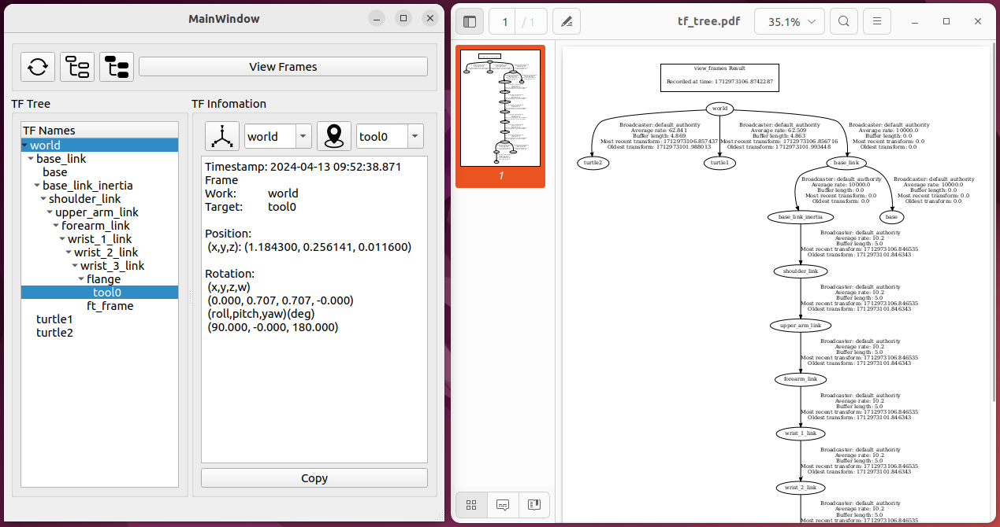

# ARC TF Viewer

## About

A tool for visualizing TF frames coordinate systems through a UI



## Usage

Run some example programs that can generate TF, for example:

```shell
ros2 launch turtle_tf2_py turtle_tf2_demo.launch.py
```

```shell
ros2 launch ur_description view_ur.launch.py ur_type:=ur10
```

Then run the UI:

```shell
ros2 run arc_tf_viewer ui
```


## Install

Because it's written in Qt, compiling will require Qt.

```shell
sudo apt install qtcreator
```

**Download:**

```
cd ~/ros2_ws/src
git clone https://github.com/HowardWhile/arc_tf_viewer.git
```

Installing the necessary ROS packages, most of which are related to `tf2_ros`, so they are typically included with a standard ROS2 installation.

```shell
rosdep install --from-paths src --ignore-src
```

**Compile:**

```shell
cd ~/ros2_ws
colcon build
```

**Execute:**

```shell
source install/setup.bash
ros2 run arc_tf_viewer ui
```


## Next

I want to add a scope to display TF information similar to [ScottPlot](https://scottplot.net/)....

